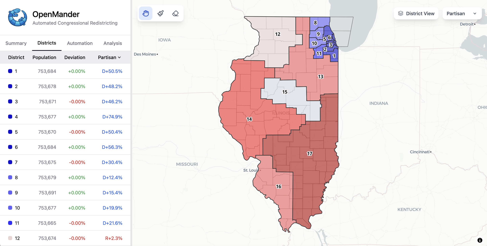

# Openmander

Openmander is an interactive redistricting app that lets you draw congressional district maps for ~~all~~ most US states. Select a state, paint districts onto the map at the census block level, and see live demographic and partisan statistics update as you draw.

**[Try it at openmander.org](https://openmander.org)**



## About

Built with React, MapLibre GL, and a Rust/WebAssembly backend for fast computation over 2020 Census data. District boundaries are drawn at the census block level using a planar graph partitioning engine.

## Development

```bash
npm install
npm run dev   # Vite dev server at http://localhost:10001
```

WASM bindings must be built first — see [`openmander-core`](https://github.com/Ben1152000/openmander-core).
